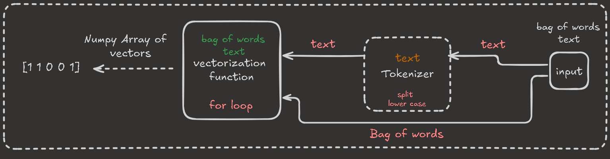

# Vectorization Function Assignment

This is a simple **Bag of Words** approach to convert a text string into a **binary vector** based on a fixed vocabulary (bag of words).

## What it does

The function takes:
- `text`: a sentence/string.
- `bag_of_words`: a list of vocabulary words.

It returns a vector with length = `len(bag_of_words)`:
- `1` if the vocabulary word appears in the text
- `0` otherwise

## Function
File: `vectorization.py`

```python
change_text_to_vector(text, bag_of_words)
```

## Example

```python
from vectorization import change_text_to_vector

text = "I love Python"
bag = ["python", "java", "love"]

vec = change_text_to_vector(text, bag)
print(vec)  # [1. 0. 1.]
```


